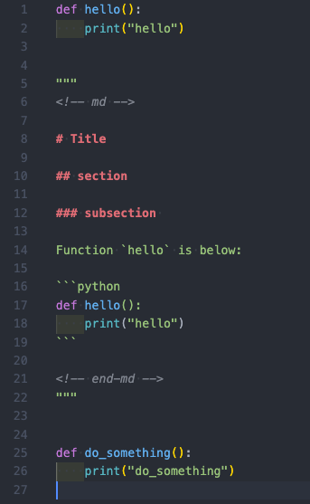
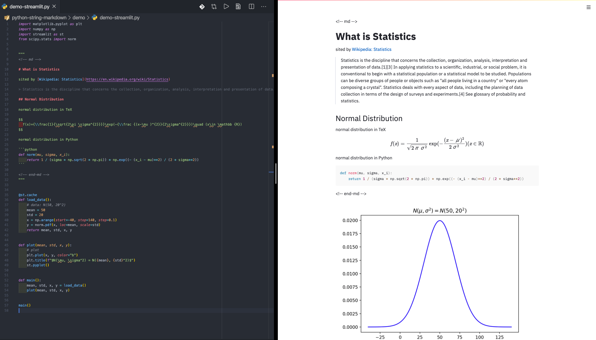

# Markdown highlighting in Python multiline strings for Visual Studio Code

Adds syntax highlight support for python multiline Markdown strings in Visual Studio Code.
This should be helpful when using [streamlit](https://github.com/streamlit/streamlit), "the fastest way to build costom ML tools".

## Installation

Install `python-string-markdown` from extensions (`ctrl + shift + x` or `cmd + shift + x` on mac).

> Also available on [marketplace.visualstudio.com](https://marketplace.visualstudio.com/items?itemName=nukopy.python-string-markdown)

## Requirements

- Visual Studio Code v1.45.1 recommended
- Comments at beginning and end of highlighted section in the string (see Usage section).

## Usage

### Basic

Insert `<!-- md -->` at the beginning of the part of the string you would like highlighted and insert `<!-- end-md -->` at the end of the highlighted section.

- `demo/demo.py`

### Use with streamlit

This extension should be helpful when using [streamlit](https://github.com/streamlit/streamlit), "the fastest way to build costom ML tools".
If you use streamlit, you can write texts in Markdown in Python docsting written with three double-quotation like `""" text """`.
However, texts in docsting is not highlighted, so this extension would be helpful.

### Snippets

Begin typing `md`, `markdown`, or `md/markdown` and the autocomplete snippet will appear:

## Community

- 2020-06-10 forked from [python-string-sql](https://github.com/ptweir/python-string-sql)

## Release Notes

### [0.1.0] - 2020-06-10

- Published on VS Code marketplace

### [0.0.1] - 2020-06-10

#### Added

- First working version
